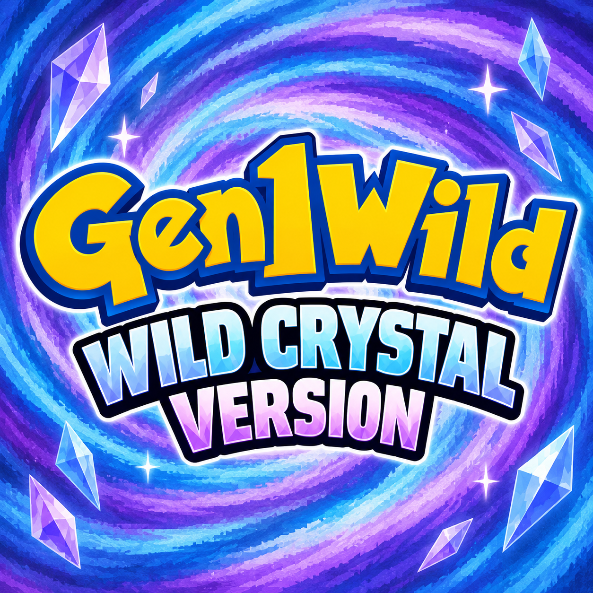

  

# Wild Crystal

**Johto, with everything the suite learned on Kanto.**

Crystal is already the best of the three Gen 2 carts — the animated sprites,
the girl you can play as, the Battle Tower, Suicune's whole story. It never
needed rescuing the way Red did. So this cart is not a rescue: it is the
Gen1Wild suite brought over to a game that was already good, doing the things
Crystal's own menus never got around to.

**And you can catch every single one of them.** All 251, in one save, on one
cartridge, without trading — the trade evolutions handled, the roamers
catchable, the legendaries back where they were if you knock them out, and the
GS BALL finally handing over the CELEBI event that shipped finished and
unreachable everywhere outside Japan.

## It is a version, not a mod list

Wild Crystal is a [custom cart][carts] for [gen1recomp][engine]: a fixed set of
mods that plays as its own game, with its own entry in the launcher, its own
cartridge and label, and its own save slots. Nothing here writes into your base
Crystal saves. Two people running Wild Crystal are running the same game.

| | Pinned | What it is |
|---|---|---|
|  | **[Gen1WildQOL][qol]** | Everything that makes the game *play* better: sprinting, autosave, auto continue, sound, followers, all 251, the GS BALL, EXP share, the move reminder, menu layout and the mod manager. |
|  | **[Gen1WildUI][ui]** | Everything that makes it *look* better: battle backdrops for Johto, the battle intro and menus, the #DEX, the box, the party menu, the PACK, item icons and descriptions. |

Two mods, not four. Crystal ships its own animated battle sprites and its own
shiny reveals, so the mod Wild Green pins for those has nothing to do here; and
there is no player recolour, because the cart already lets you choose.

The mod set is sealed: these two run exactly as pinned, and nothing can be
added to them or taken out. That is what makes the cart playable online, where
both sides have to be running the same game; the launcher's **ONLINE** tab
lists sealed carts and nothing else. Every feature inside the two is still a
switch you can flip, so the cart is still yours to play your own way.

If you want it with your own mods instead, break the seal on a save slot from
the cart's page. That save loads the pinned two first and then everything else
you have enabled. It is marked modified, and it cannot go online.

The base game is **Crystal**. The cart carries no game data and no ROM bytes;
you bring your own, exactly as the engine already asks.

## Trading with Wild Green

**You can move POKéMON between this cart and [Wild Green][green], and it is the
Time Capsule that does it** — not the link cable.

Open the trade tool, put a Wild Green save on one side and a Wild Crystal save
on the other, and the engine converts each POKéMON as it crosses. The two carts
keep entirely separate save scopes and neither knows about the other; nothing
in the trade tool asks which cart a save came from, so a sealed cart is no
obstacle to it.

Going *up* to Crystal, a Kanto POKéMON arrives with its level, its nickname and
its stat experience intact, its SPECIAL split into the two Gen 2 stats, and a
friendship value it never had. Coming back *down*, the cartridge's own rules
apply, and they are strict for a reason:

- a **Johto POKéMON cannot go to Wild Green** — Red has no room in its dex for
  it, and nothing to draw;
- a POKéMON knowing a **move Gen 1 never had** is refused rather than having
  the move quietly replaced;
- a POKéMON **holding MAIL** is refused, because Red has nowhere to put the
  letter.

Each refusal names itself before anything moves, so nothing is ever half
traded.

What you cannot do is put the two carts on a **live cable** and battle or trade
in real time. The engine refuses a cross-generation pairing outright, and that
is the honest answer rather than a missing feature: a lockstep battle between
two different games is two different rulebooks. Wild Green trades with Wild
Green and Wild Crystal with Wild Crystal; between them, it is the Time Capsule.

## Installing it

Download `wild_crystal-<version>.g1rcart` from
[Releases](https://github.com/wild1walker/Gen1WildCrystal/releases) and open it
from the game — **Custom Carts > Import a cart** on desktop, or drop the file
into the `carts` folder of your save directory and the launcher picks it up.

If a pinned mod is missing, the cart's own page offers **Install required
mods** and fetches them for you. Reach for that rather than breaking the seal.

## If you want to test what is coming

This cart does not move while a change is being worked on. New work goes to a
**nightly** channel instead, and it is a separate thing you install on purpose:

**MODS > FIND MODS**, add `wild1walker/Gen1NightlyIndex`.

The nightly cart is **Wild Crystal Nightly** — a dark blue cartridge with the
test bench pinned alongside, so the two are never confused on a shelf. Every
mod in it carries an id of its own and conflicts with the one here, so running
a nightly cannot touch this cart, its settings or its saves; and because it is
a cart of its own, it has save slots of its own too.

They are test builds and can be broken in ways a release is not. That is the
whole point of them, and it is the only reason to install one.

The index is [Gen1NightlyIndex][nightlyindex] and the source is
[Gen1NightlyMods][nightlymods].

## Credits

- **[Gen1Wild][index]** — the suite this is the version of, and the wordmark
  on the label.
- **[Gen1Recomp][engine]** — the engine, the cart format, and the Time Capsule
  conversion this cart trades through.
- **pret** — the disassemblies underneath all of it, `pokecrystal` included.

## Licence

MIT. See [LICENSE](LICENSE).

[engine]: https://github.com/bryanthaboi/gen1recomp
[carts]: https://github.com/bryanthaboi/gen1recomp/wiki/Guide-Custom-Carts
[index]: https://github.com/wild1walker/Gen1Wild
[ui]: https://github.com/wild1walker/Gen1WildUI
[qol]: https://github.com/wild1walker/Gen1WildQOL
[green]: https://github.com/wild1walker/Gen1WildGreen
[nightlyindex]: https://github.com/wild1walker/Gen1NightlyIndex
[nightlymods]: https://github.com/wild1walker/Gen1NightlyMods
